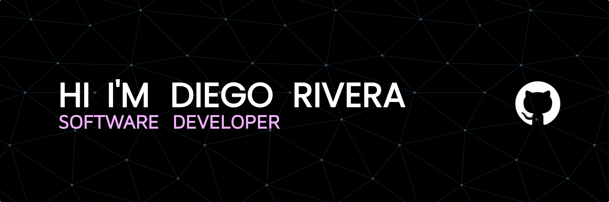

  
  
  

### 👇 About Me

I'm from Chile. I hold a degree as an Analyst Programmer and am currently on the path to completing my Computer Engineering degree. My journey in the programming world has been centered on the exciting realm of web development.

Since I started my journey in programming, I've been focused on web development, and I've particularly dedicated myself to perfecting my skills in frontend development.

I look forward to the opportunity to collaborate with you on exciting web development projects in the future!

- 🌱 I’m currently learning **Next.js & NestJS**
  
- 👨‍💻 All of my projects are available at [codiegos.vercel.app](https://codiegos.vercel.app/#projects)

- 📫 How to reach me **codiegos@outlook.com**

### 🛠 My Knowledge

### 📚 Github Status

  
  

